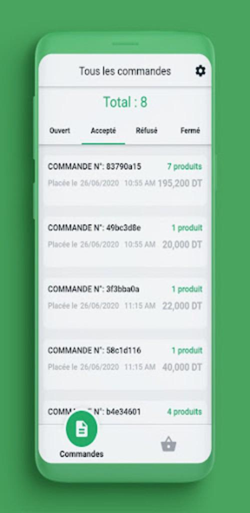
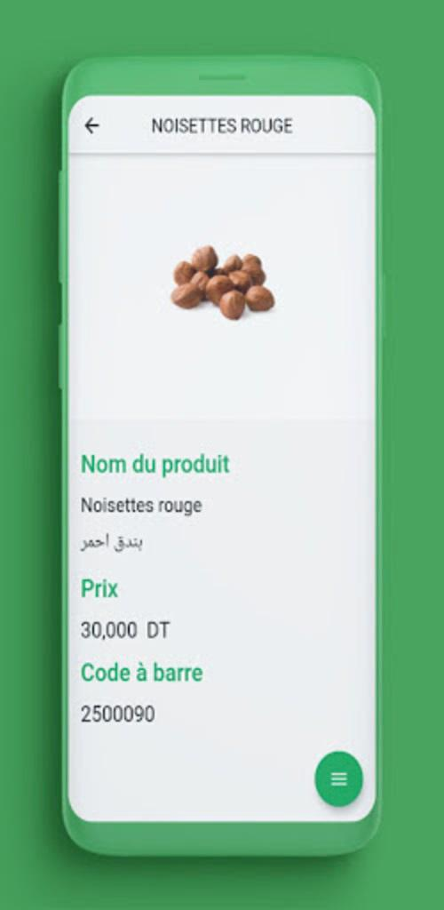

# Shopoo

Shopoo is a mobile application developed using Flutter, catering specifically to grocery store owners. It serves as an admin application, providing a convenient platform for owners to manage their grocery store inventory and related information. Shopoo is designed to work seamlessly on both Android and iOS devices, ensuring a wide reach for users.

Key Features of Shopoo:

1. Product Management: Shopoo enables grocery store owners to easily add and manage their products. Owners can add product details such as names, descriptions, images, and prices. They also have the flexibility to make edits and updates to product information as needed.

2. Image Upload: Shopoo allows grocery store owners to include images of their products, enhancing the visual appeal of the app and making it easier for customers to browse and make informed purchase decisions.

3. Pricing Management: Owners have the ability to set prices for their products within the Shopoo app. This feature enables them to keep track of pricing information and make necessary adjustments when required.

4. Location Integration with Google Maps: Shopoo offers integration with Google Maps to facilitate accurate location representation for each grocery store. Owners can specify the exact location of their store, making it easier for customers to find them using the associated customer application.

5. Customer-Facing Application: Alongside the admin application, Shopoo also includes a separate customer application. This application is designed for regular customers and provides them with access to grocery store information, including store names and details.

6. Django Backend Platform: Shopoo utilizes the Django backend platform to handle and manage all application data. The applications (admin and customer) are connected through APIs, ensuring seamless communication and synchronization of information.

7. Multi-language support

Please note that as Shopoo is a customized application developed for a specific client, sharing the source code may not be feasible due to confidentiality and intellectual property reasons. However, the provided description outlines the key functionalities and features of the application.

## feel free to contact us : https://wa.me/21654120687 or chahedmoetaz@gmail.com

## Photos

